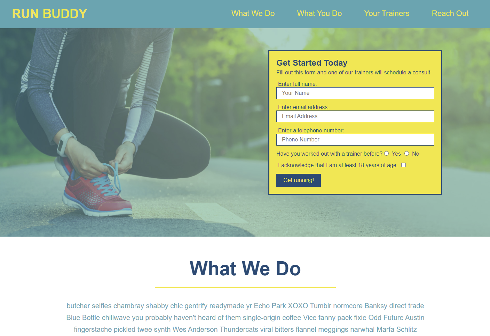
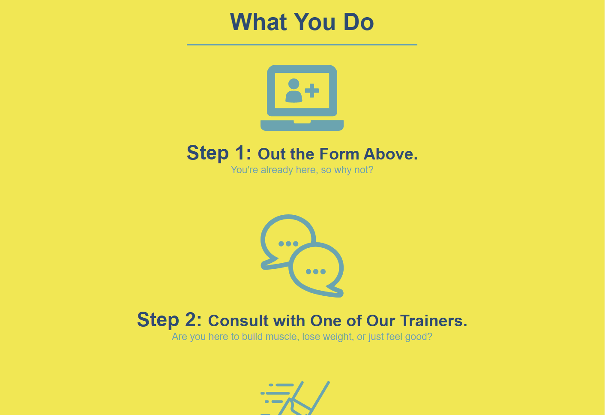
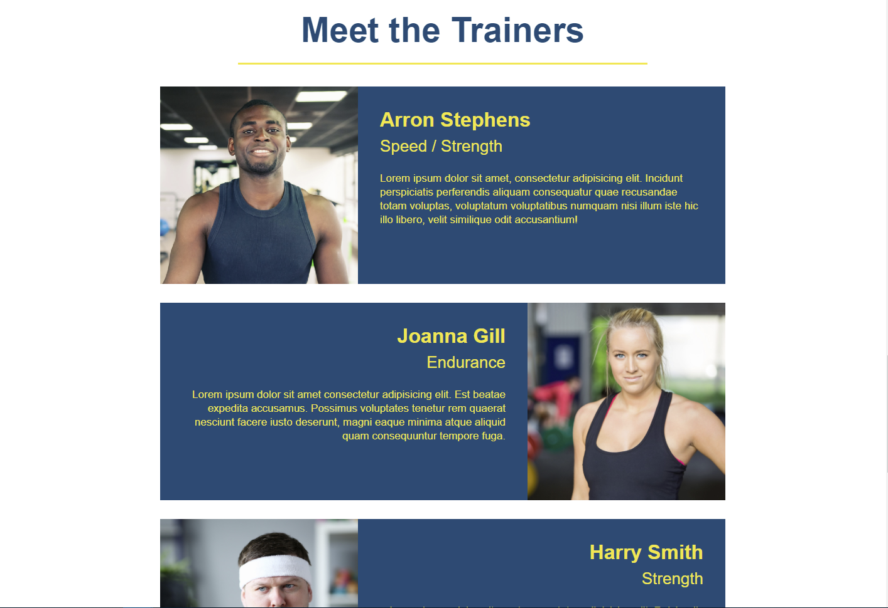
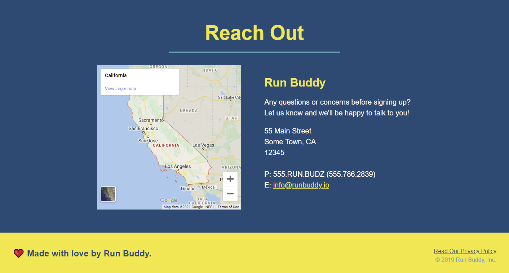

# A Landing Page #
This is an example of the basics I've learned in front-end web development through my certificate program. This page uses the basics of HTML and CSS. It also shows an understanding of links, forms, styling, page layout, and relative paths.

## Screenshots ##

## Link ##
https://sirubu.github.io/run-buddy/